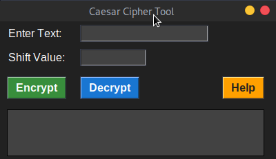
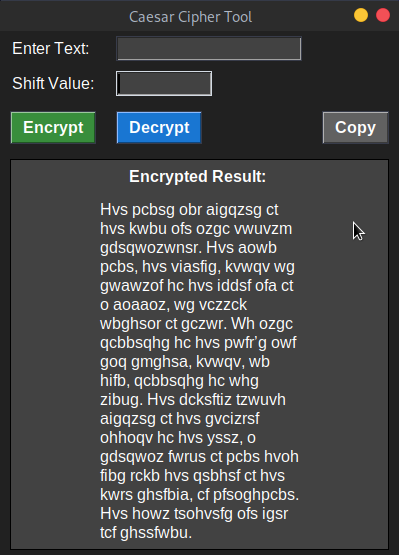
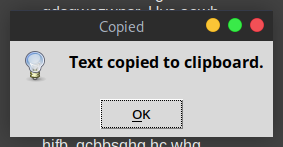

# 🔐 Caesar Cipher Tool

  

Welcome to the Caesar Cipher Tool repository! This tool allows you to encrypt and decrypt text using the Caesar Cipher algorithm. Let's get started! 🚀

## 🔧 Features

### 🔑 Encrypting Text

Encrypt your text by shifting each letter by a specified number of positions. This feature helps to encode your messages with a simple yet effective algorithm.

### 🔓 Decrypting Text

Decrypt previously encrypted text by shifting the letters back by the specified number of positions. This feature helps to decode the messages back to their original form.

### 📝 Logging Operations

Each encryption and decryption operation is logged into a history file (`history.txt`). This allows you to keep track of your previous operations.

### 📋 Copy Result to Clipboard

Easily copy the encrypted or decrypted text to your clipboard with the click of a button.

## 🖥️ Usage

Follow these steps to use the Caesar Cipher Tool:

1. **Enter Text**: Type the text you want to encrypt or decrypt in the input field.
2. **Enter Shift Value**: Provide the shift value (an integer) that will be used for the Caesar Cipher.
3. **Click Encrypt/Decrypt**: Perform the desired operation by clicking the respective button.
4. **Copy Result**: Copy the result to the clipboard by clicking the "Copy" button that appears after the operation.

## 📂 File Descriptions

### `caesar_cipher.py`

This file contains the main code for the Caesar Cipher Tool. It includes functions for encryption, decryption, logging operations, and handling the GUI.

### `history.txt`

This file logs each encryption and decryption operation performed by the tool, including the input text, shift value, direction (encrypt or decrypt), and the output result.

## 🖼️ Outputs

Explore the visual outputs of the Caesar Cipher Tool:

  
  
Encryption Operation

   
  
  
Decryption Operation

   
  
  
Copy Result Operation

## 🛠️ How to Run

1. Ensure you have Python installed on your system.
2. Install the required library: `pip install pyperclip`.
3. Run the script: `python caesar_cipher.py`.

Enjoy using the Caesar Cipher Tool! 🎉