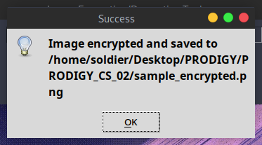
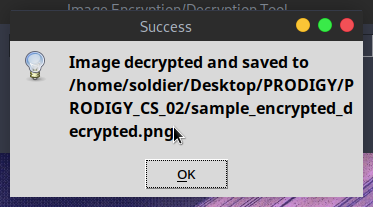

# 🖼️ Image Encryption/Decryption Tool

  

Welcome to the Image Encryption/Decryption Tool repository! This tool allows you to encrypt and decrypt images using a specified key. Let's get started! 🚀

## 🔧 Features

### 🔒 Encrypting Images

Encrypt your images by adding a key to each pixel value. This feature helps secure your images from unauthorized access.

### 🔓 Decrypting Images

Decrypt previously encrypted images by subtracting the key from each pixel value. This feature restores the original images from their encrypted versions.

### 📝 Logging Operations

Each encryption and decryption operation is logged into a history file (`history.txt`). This log helps you keep track of all encryption and decryption activities.

### 🖼️ Viewing Output

Easily view the encrypted or decrypted images within the tool. This feature enhances user experience and allows for quick validation of results.

## 🖥️ Usage

Follow these steps to use the Image Encryption/Decryption Tool:

1. **Select Image**: Click the Browse button to select an image for encryption or decryption.
2. **Enter Key**: Enter the encryption/decryption key (a positive integer) into the Key field.
3. **Perform Operation**: Click the Encrypt button to encrypt the selected image or the Decrypt button to decrypt it.
4. **View Result**: Click the View button to open the encrypted or decrypted image for inspection.

## 📂 File Descriptions

### `image_cipher.py`

This file contains the main code for the Image Encryption/Decryption Tool. It includes functions for image encryption, decryption, logging operations, and GUI handling.

### `history.txt`

This file logs each encryption and decryption operation performed by the tool, including the input image path, output image path, key, and operation type (encryption or decryption).

## 🖼️ Outputs

Explore the visual outputs of the Image Encryption/Decryption Tool:

  
  
  
Encryption Operation

   
  
  
  
Decryption Operation

## 🛠️ How to Run

1. Ensure you have Python installed on your system.
2. Install the required library: `pip install numpy pillow`.
3. Run the script: `python image_cipher.py`.

Enjoy using the Image Encryption/Decryption Tool! 🎉
